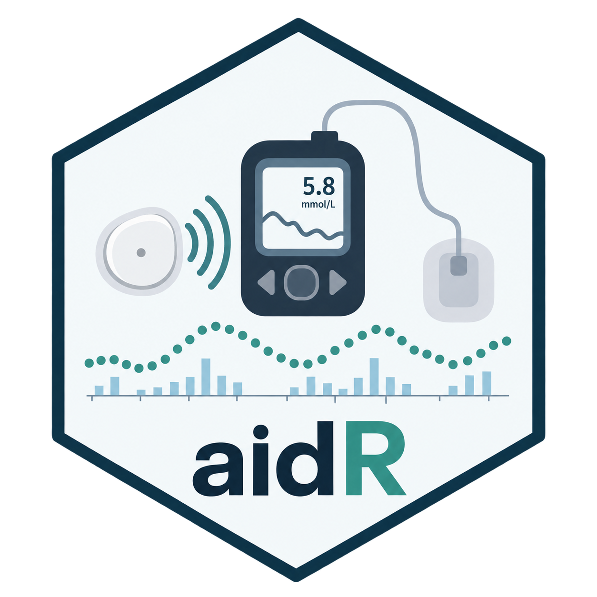
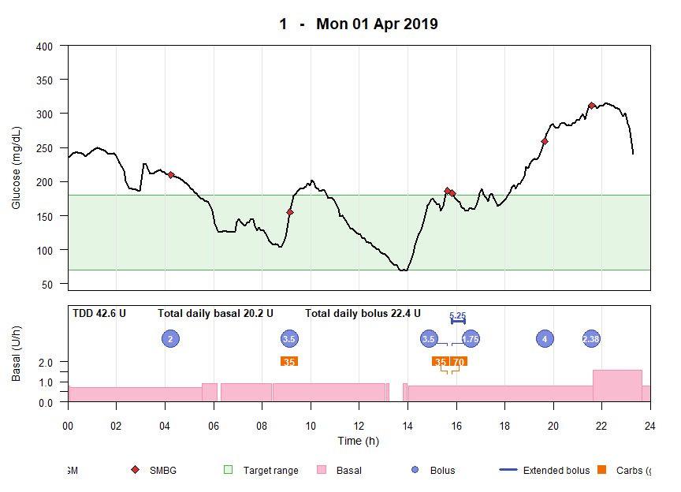

<p align="center">
  
</p>

<p align="center">
  <strong>Read and standardize data from automated insulin delivery systems</strong>
</p>

<p align="center">
  
  
  
</p>

<p align="center">
  <a href="#what-can-aidr-do">Overview</a> •
  <a href="#supported-export-formats">Formats</a> •
  <a href="#installation">Installation</a> •
  <a href="#quick-start">Quick start</a> •
  <a href="#documentation">Documentation</a> •
  <a href="#citation">Citation</a> •
  <a href="#contributing">Contributing</a> •
  <a href="#license">License</a> •
  <a href="#contact">Contact</a>
</p>

---

**aidR** is an open-source R package for reading and standardizing data exported from automated insulin delivery (AID) systems.

AID platforms differ in their file formats, variable names, units, timestamp conventions, and representation of clinically relevant events. `aidR` maps these heterogeneous exports to a common, analysis-ready format, allowing downstream analyses to be written once and applied consistently across AID systems.


## What can aidR do?

`aidR` provides a common workflow for AID data:

- **Read** native exports from seven major diabetes management platforms
- **Standardize** CGM, basal, bolus, carbohydrate, and SMBG data
- **Filter** CGM data and duplicated streams
- **Check** data completeness and insulin totals
- **Visualize** daily glucose, insulin, carbohydrate, and SMBG data
- **Merge** data across participants and AID systems
- **Convert** data to [DIAX](https://github.com/Center-for-Diabetes-Technology/DIAX) and formats used by [`iglu`](https://irinagain.github.io/iglu/) and [`cgmquantify`](https://cran.r-project.org/package=cgmquantify)

<p align="center">
  
  
</p>

## Supported export formats

`aidR` currently supports seven export formats:

| Platform | Export format | Example AID systems |
|---|---|---|
| **Glooko** | Folder with one CSV per data type | CamAPS FX, Omnipod |
| **CareLink (Medtronic)** | Single `.xlsx` or `.csv` export | MiniMed 780G |
| **mylife Cloud (Ypsomed)** | Single semicolon-delimited CSV | CamAPS FX |
| **Tidepool** | Multi-sheet `.xlsx` workbook | Tandem Control-IQ, Loop, AAPS |
| **YourLoops (Diabeloop)** | Folder with one CSV per data type | DBLG1, DBLG2 |
| **Tandem Source** | Folder with one CSV per data type | Tandem Control-IQ |
| **Dexcom Clarity** | Single delimited CSV (CGM only) | Any AID system using a Dexcom sensor |

## Installation

Install `aidR` from CRAN:

```r
install.packages("aidR")
```

Then load the package:

```r
library(aidR)
```

## Quick start

The main entry point is `parse_data()`, which reads a subject's AID export and standardizes the major data types into a common format.

```r
library(aidR)

data <- parse_data(
  id = "1",
  paths = "inst/extdata/glooko_example.zip"
)

names(data)
#> [1] "cgm"         "basal"       "bolus"       "SMBG"
#> [5] "carbs"       "total_basal" "total_bolus"
```
### Visualizing AID data

`plot_day()` provides a daily overview of glucose, insulin delivery, carbohydrate entries, and SMBG measurements.

<p align="center">
  
</p>

## Documentation

For a complete walkthrough — including supported export formats, filtering, quality checks, visualization, merging participants, and conversion to other formats — see the package vignette.

```r
vignette("aidR")
```

## Citation

A manuscript describing `aidR` and its design is currently in preparation.

If you use `aidR` in research, please cite the package and, once available, the accompanying publication.

```r
citation("aidR")
```

## Contributing

Contributions are welcome. In particular, we welcome support for new AID platforms and updates to existing parsers when export formats change.

Please use the [GitHub issue tracker](https://github.com/madleina/aidR/issues) for bugs and feature requests.

> [!IMPORTANT]
> When reporting parsing problems, **do not upload identifiable patient data** to a public GitHub issue.

## License

`aidR` is open-source software licensed under the **GNU General Public License v3.0 (GPL-3.0)**.

## Contact

`aidR` is developed at the **Diabetes Center Berne** in Bern, Switzerland.

For questions, suggestions, or collaboration inquiries: **datascience@dcberne.com**

---

<p align="center">
  <sub>From heterogeneous AID exports to analysis-ready data.</sub>
</p>

<p align="center">
  <a href="#top">↑ Back to top</a>
</p>